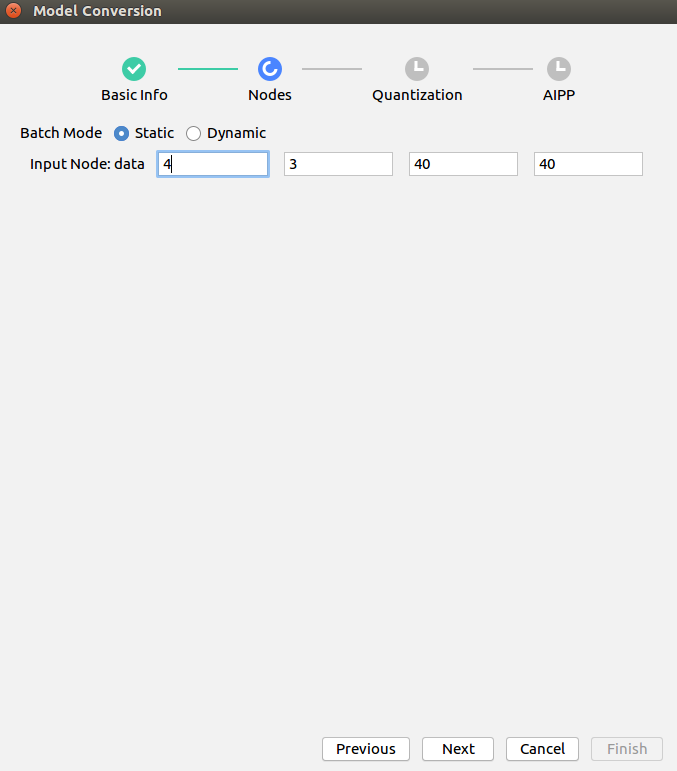
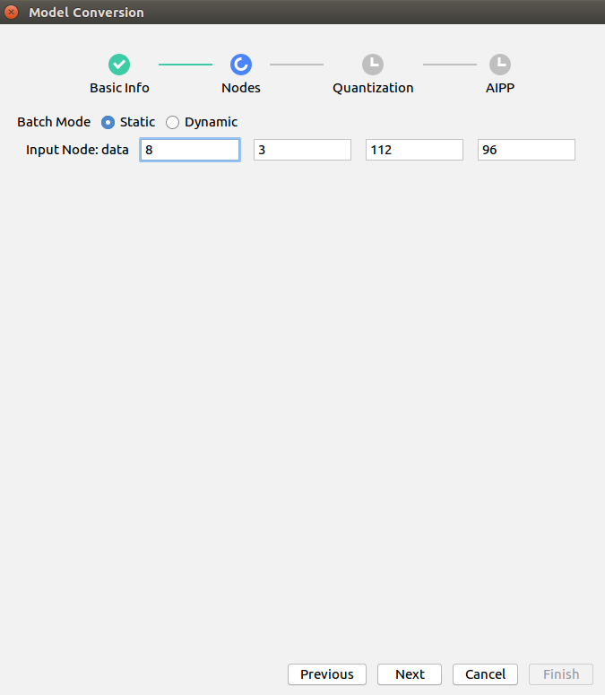
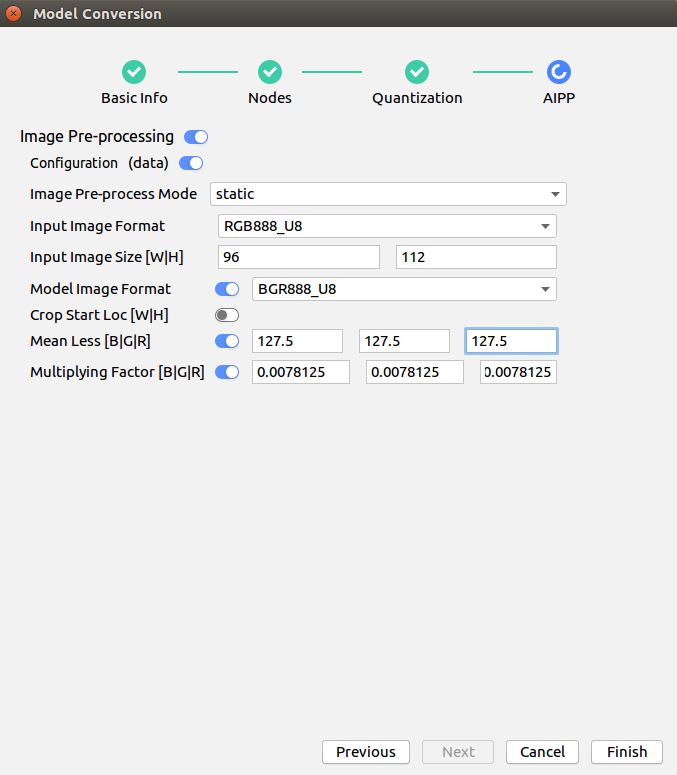
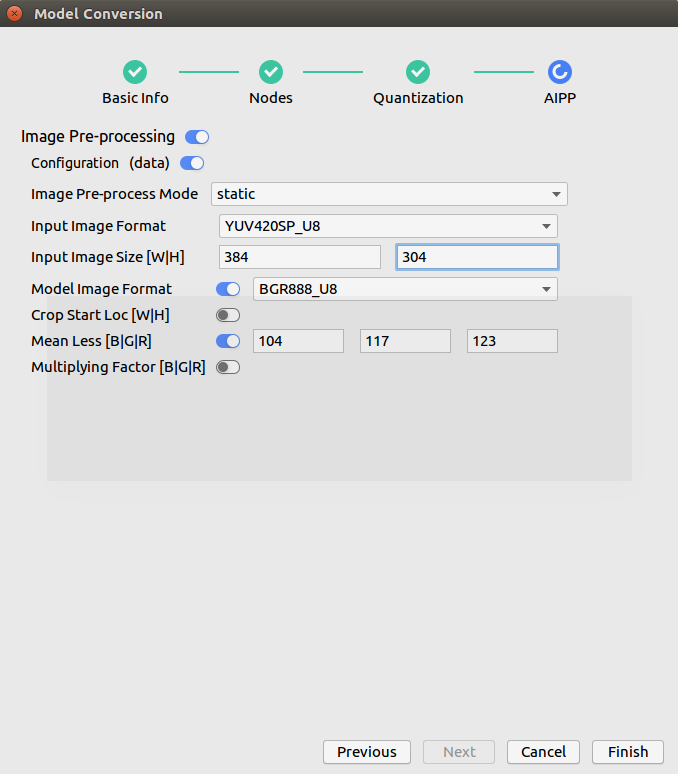
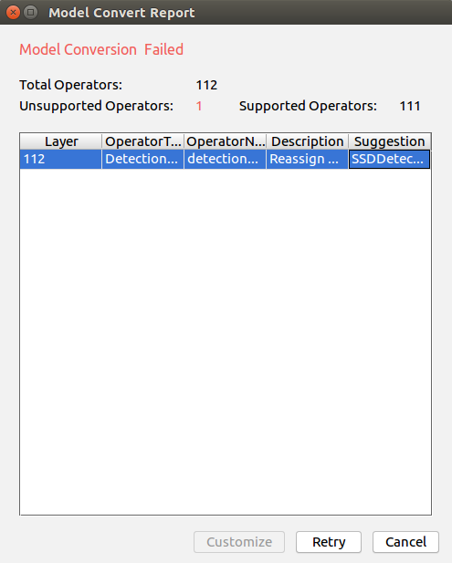

EN|[CN](README_en.md)

# Facial Recognition<a name="ZH-CN_TOPIC_0208835545"></a>

Developers can deploy the application on the Atlas 200 DK to register a face, predict the face information in the video by using the camera, and compare the predicted face with the registered face to predict the most possible user.

## Prerequisites<a name="zh-cn_topic_0203223340_section137245294533"></a>

Before using an open source application, ensure that:

-   Mind Studio  has been installed.
-   The Atlas 200 DK developer board has been connected to  Mind Studio, the cross compiler has been installed, the SD card has been prepared, and basic information has been configured.

## Software Preparation<a name="zh-cn_topic_0203223340_section8534138124114"></a>

Before running the application, obtain the source code package and configure the environment as follows.

1.  <a name="zh-cn_topic_0203223340_li953280133816"></a>Obtain the source code package.

    ownload all the code in the sample-facialrecognition repository at  [https://github.com/Atlas200DKTest/sample-facialrecognition/tree/1.3x.0.0/](https://github.com/Atlas200DKTest/sample-facialrecognition/tree/1.3x.0.0/)to any directory on Ubuntu Server where  Mind Studio  is located as the **Mind Studio**  installation user, for example,  **$HOME/AscendProjects/sample-facialrecognition**.

2.  <a name="zh-cn_topic_0203223340_li99811487013"></a>Obtain the source network model required by the application.


    Obtain the source network model and its weight file used in the application by referring to  [Table 1](#zh-cn_topic_0203223340_table97791025517), and save them to any directory on the Ubuntu server where  Mind Studio  is located (for example, **$HOME/models/facialrecognition**.)

    **Table  1**  Models used for Facial Recognition

    <a name="zh-cn_topic_0203223340_table97791025517"></a>
    <table><thead align="left"><tr id="zh-cn_topic_0203223340_row48791253115"><th class="cellrowborder" valign="top" width="13.309999999999999%" id="mcps1.2.4.1.1"><p id="zh-cn_topic_0203223340_p187902511114"><a name="zh-cn_topic_0203223340_p187902511114"></a><a name="zh-cn_topic_0203223340_p187902511114"></a>Model Name</p>
    </th>
    <th class="cellrowborder" valign="top" width="12.04%" id="mcps1.2.4.1.2"><p id="zh-cn_topic_0203223340_p148791259118"><a name="zh-cn_topic_0203223340_p148791259118"></a><a name="zh-cn_topic_0203223340_p148791259118"></a>Model Description</p>
    </th>
    <th class="cellrowborder" valign="top" width="74.65%" id="mcps1.2.4.1.3"><p id="zh-cn_topic_0203223340_p987922511111"><a name="zh-cn_topic_0203223340_p987922511111"></a><a name="zh-cn_topic_0203223340_p987922511111"></a>Model Download Path</p>
    </th>
    </tr>
    </thead>
    <tbody><tr id="zh-cn_topic_0203223340_row38791825912"><td class="cellrowborder" valign="top" width="13.309999999999999%" headers="mcps1.2.4.1.1 "><p id="zh-cn_topic_0203223340_p0879152519115"><a name="zh-cn_topic_0203223340_p0879152519115"></a><a name="zh-cn_topic_0203223340_p0879152519115"></a>face_detection</p>
    </td>
    <td class="cellrowborder" valign="top" width="12.04%" headers="mcps1.2.4.1.2 "><p id="zh-cn_topic_0203223340_p9879112516111"><a name="zh-cn_topic_0203223340_p9879112516111"></a><a name="zh-cn_topic_0203223340_p9879112516111"></a>Network model for face detection.</p>
    <p id="zh-cn_topic_0203223340_p1087912253112"><a name="zh-cn_topic_0203223340_p1087912253112"></a><a name="zh-cn_topic_0203223340_p1087912253112"></a>It is a network model converted from ResNet0-SSD300 model based on Caffe.</p>
    </td>
    <td class="cellrowborder" valign="top" width="74.65%" headers="mcps1.2.4.1.3 "><p id="zh-cn_topic_0203223340_p188801525813"><a name="zh-cn_topic_0203223340_p188801525813"></a><a name="zh-cn_topic_0203223340_p188801525813"></a>>Download the source network model file and its weight file by referring to<strong id="en-us_topic_0182554631_b6722175014127"><a name="en-us_topic_0182554631_b6722175014127"></a><a name="en-us_topic_0182554631_b6722175014127"></a> README.md</strong> in <a href="https://github.com/HuaweiAscendTest/models/tree/master/computer_vision/object_detect/face_detection" target="_blank" rel="noopener noreferrer">https://github.com/HuaweiAscendTest/models/tree/master/computer_vision/object_detect/face_detection</a>.</p>
    </td>
    </tr>
    <tr id="zh-cn_topic_0203223340_row11880162511114"><td class="cellrowborder" valign="top" width="13.309999999999999%" headers="mcps1.2.4.1.1 "><p id="zh-cn_topic_0203223340_p1388012251117"><a name="zh-cn_topic_0203223340_p1388012251117"></a><a name="zh-cn_topic_0203223340_p1388012251117"></a>vanillacnn</p>
    </td>
    <td class="cellrowborder" valign="top" width="12.04%" headers="mcps1.2.4.1.2 "><p id="zh-cn_topic_0203223340_p1988018251110"><a name="zh-cn_topic_0203223340_p1988018251110"></a><a name="zh-cn_topic_0203223340_p1988018251110"></a>>Network model for marking facial feature points.</p>
    <p id="zh-cn_topic_0203223340_p588013251514"><a name="zh-cn_topic_0203223340_p588013251514"></a><a name="zh-cn_topic_0203223340_p588013251514"></a>It is a network model converted from the VanillaCNN model based on Caffe.</p>
    </td>
    <td class="cellrowborder" valign="top" width="74.65%" headers="mcps1.2.4.1.3 "><p id="zh-cn_topic_0203223340_p28801025319"><a name="zh-cn_topic_0203223340_p28801025319"></a><a name="zh-cn_topic_0203223340_p28801025319"></a>Download the source network model file and its weight file by referring to<strong id="en-us_topic_0182554631_b47241650201210"><a name="en-us_topic_0182554631_b47241650201210"></a><a name="en-us_topic_0182554631_b47241650201210"></a> README.md</strong> in <a href="https://github.com/HuaweiAscendTest/models/tree/master/computer_vision/classification/vanillacnn" target="_blank" rel="noopener noreferrer">https://github.com/HuaweiAscendTest/models/tree/master/computer_vision/classification/vanillacnn</a><span>.</p>
    </td>
    </tr>
    <tr id="zh-cn_topic_0203223340_row988092511120"><td class="cellrowborder" valign="top" width="13.309999999999999%" headers="mcps1.2.4.1.1 "><p id="zh-cn_topic_0203223340_p108806251513"><a name="zh-cn_topic_0203223340_p108806251513"></a><a name="zh-cn_topic_0203223340_p108806251513"></a>sphereface</p>
    </td>
    <td class="cellrowborder" valign="top" width="12.04%" headers="mcps1.2.4.1.2 "><p id="zh-cn_topic_0203223340_p68802251019"><a name="zh-cn_topic_0203223340_p68802251019"></a><a name="zh-cn_topic_0203223340_p68802251019"></a>Network model for obtaining feature vectors.</p>
    <p id="zh-cn_topic_0203223340_p148801125512"><a name="zh-cn_topic_0203223340_p148801125512"></a><a name="zh-cn_topic_0203223340_p148801125512"></a>It is a network model converted from the SphereFace model based on Caffe.</p>
    </td>
    <td class="cellrowborder" valign="top" width="74.65%" headers="mcps1.2.4.1.3 "><p id="zh-cn_topic_0203223340_p128806251116"><a name="zh-cn_topic_0203223340_p128806251116"></a><a name="zh-cn_topic_0203223340_p128806251116"></a>Download the source network model file and its weight file by referring to<strong id="en-us_topic_0182554631_b27251650191215"><a name="en-us_topic_0182554631_b27251650191215"></a><a name="en-us_topic_0182554631_b27251650191215"></a> README.md</strong> in <a href="https://github.com/HuaweiAscendTest/models/tree/master/computer_vision/classification/sphereface" target="_blank" rel="noopener noreferrer">https://github.com/HuaweiAscendTest/models/tree/master/computer_vision/classification/sphereface</a><span>.</p>
    </td>
    </tr>
    </tbody>
    </table>

3.   Log in to Ubuntu Server where Mind Studio is located as the Mind Studio installation user, confirm current DDK version and set the  environment variable  **DDK\_HOME**, **tools\_version**, **NPU\_DEVICE\_LIB** and **LD\_LIBRARY\_PATH**.

     1.  <a name="zh-cn_topic_0203223340_zh-cn_topic_0203223294_li61417158198"></a>Find current DDK version number.

         Current DDK version number can be obtained by either Mind studio tool or DDK packages.

         -    Using Mind studio tool.
        
              choose **File \> Settings \> System Settings \> Ascend DDK** from the main menu of Mind Studio, DDK version inquiry page will display as [Figure 1](zh-cn_topic_0203223294.md#fig94023140222).
 
              **Figure 1** DDK version inquiry page<a name="zh-cn_topic_0203223340_zh-cn_topic_0203223294_fig17553193319118"></a>  
              
 
              **DDK Version** shows in this page is current DDK version, for example, **1.31.T15.B150**.
             
         -   Using DDK package
             
             Obtain DDK version by installed DDK package name.
             
             The format of DDK package name is: **Ascend\_DDK-\{software version}-\{interface version}-x86\_64.ubuntu16.04.tar.gz**
             
             Where **software version** represents the DDK version.
             
             For example:
             
             If the name of DDK package is **Ascend\_DDK-1.31.T15.B150-1.1.1-x86\_64.ubuntu16.04.tar.gz**, the DDK version would be **1.31.T15.B150**.
             
     2.  Set the environment variable.

         **vim \~/.bashrc**

          Run the following commands to add the environment variables  **DDK\_HOME**  and  **LD\_LIBRARY\_PATH**  to the last line:

         **export tools\_version=_1.31.X.X_**

         **export DDK\_HOME=\\$HOME/.mindstudio/huawei/ddk/\\$tools\_version/ddk**

         **export NPU\_DEVICE\_LIB=$DDK\_HOME/../RC/host-aarch64\_Ubuntu16.04.3/lib**

         **export LD\_LIBRARY\_PATH=$DDK\_HOME/lib/x86\_64-linux-gcc5.4**

         > **NOTE：**   
         >-   **_1.31.X.X_** is the DDK version obtained from [Figure 1](#zh-cn_topic_0203223340_zh-cn_topic_0203223294_li61417158198)中it needs be filled according to the inquiry result，for example, **1.31.T15.B150**  
         >-   If the environment variables have been added, this step can be skipped.


         Enter  **:wq!**  to save and exit.

         Run the following command for the environment variable to take effect:

        **source \~/.bashrc**

4.  Convert the source network to a model supported by Ascend AI processor. There are two ways for model conversion:  Mind Studio tool conversion and command line conversion. 

    -    Model conversion using Mind Studio tool
         1.  Choose **Tool \> Convert** Model from the main menu of Mind Studio. The Convert Model page is displayed.
         2.  On the **Model** **Convert** page, perform model conversion configuration.
             -    Set **Model File** to model file installed in [Step 2](#zh-cn_topic_0203223340_li99811487013), the weight file would be automatically matched and filled in **Weight File**.
             -    Set **Model Name** to model name in [Table 1](#zh-cn_topic_0203223340_table97791025517).
             -    The non-default configuration of **VanillaCNNModel** model conversion is as follows:

                  -  Set the value of **N** in "**Input Node:data**" in Nodes configuration to **4**，this parameter needs to be consistent with the value of "**batch\_size**" of the corresponding model in "**graph\_template.config**, retain **C**、**H**、**W** to the default value, as shown in [Figure 2](#zh-cn_topic_0203223340_fig5158834193915)。
                  -   Set “"**Image Preprocess**" to **off** in AIPP configuration.

                  **Figure 2**  Nodes configuration during **VanillaCNNModel** conversion<a name="zh-cn_topic_0203223340_fig5158834193915"></a>  
                
 
                  

             -   The non-default configuration of **SpherefaceModel** conversion is as follows:

                  -    For **Input Shape** in AIPP configuration,  **N:8**  indicates that 8 images are processed each time for the facial recognition application. The value of this parameter must be the same as the value of  **batch\_size**  of the corresponding model in  **graph.config**.
                  -   Set **Input Image Format** in AIPP configuration to  **RGB888\_U8**.
                  -   Set  **Input Image Size**  in AIPP configuration to  **96**  and  **112** as required by the model. In this example, the input image format is  **RGB8888\_U8**. Therefore, 128 x 16 alignment is not required.
                  -   Set **Model Image Format** in AIPP configuration to  **RGB888\_U8**.
                  -   Set  **Mean Less[B|G|R]**  in AIPP configuration to the mean value of the images used in the model training. The value can be obtained from the  **sphereface\_model.prototxt**  file of the model.
                  -   Set  **Multiplying Factor[B|G|R]** in AIPP configuration to the multiplication factor of the images used in the model training. The value can be obtained from the** sphereface\_model.prototxt**  file of the model, that is, the value of  **scale**. 

                  **Figure 3**  Nodes configuration for **SpherefaceModel** conversion<a name="zh-cn_topic_0203223340_fig188415461909"></a>  
                

                  

                  **Figure 4**  AIPP configuration for **SpherefaceModel** conversion<a name="zh-cn_topic_0203223340_fig159362210546"></a>  
                

                  

              -   **Input Image Size** in **face\_detection** model needs to be set to 384,304，  128 \*16 alignment is required here, for **Model Image Format**, select BGR888\_U8, other parameters retain the default vaule.

                  **Figure 5**  The non-default configuration for **face\_detection**<a name="zh-cn_topic_0203223340_fig525743174114"></a>  
                

                  

          3.  lick **OK** to start model conversion.

              During the conversion of the  **face\_detection**, the following error will be reported, as shown in [Figure 6](#zh-cn_topic_0203223340_fig19683520164211).

              **Figure 6**  Model conversion error<a name="zh-cn_topic_0203223340_fig19683520164211"></a>  
            

              

              Select **SSDDetectionOutput** from the **Suggestion** drop-down list box at the **DetectionOutput** layer and click Retry.

              After successful conversion, a **.om** offline model is generated in the **$HOME/modelzoo/XXX/device**.

              > **NOTE：**   
              >-  he specific meaning and parameter description in each step of **Mind Studio** model conversion can refer to[https://ascend.huawei.com/doc/mindstudio/2.1.0\(beta\)/zh/zh-cn\_topic\_0188462651.html](https://ascend.huawei.com/doc/mindstudio/2.1.0(beta)/zh/zh-cn_topic_0188462651.html)  
              >-   XXX indicates the name of currently converted model, for example, **face\_detection.om** is saved in: **$HOME/modelzoo/face\_detection/device**.  


     -   Model conversion in command line mode:
        
         1.  Enter the folder where the source model is saved as the Mind Studio installation user.


            **cd $HOME/ascend/models/facialrecognition**

         2.  Using omg tool to run the following command to perform model conversion.

             ```
              ${DDK_HOME}/uihost/bin/omg --output="./XXX" --model="./XXX.prototxt" --framework=0 --ddk_version=${tools_version} --weight="./XXX.caffemodel" --input_shape=`head -1 $HOME/AscendProjects/sample-facialrecognition/MyModel/shape_XXX` --insert_op_conf=$HOME/AscendProjects/sample-facialrecognition/MyModel/aipp_XXX.cfg --op_name_map=$HOME/AscendProjects/sample-facialrecognition/MyModel/reassign_operators
             ```

             > **NOTE：**   
             >-   All files required for **input\_shape**、**insert\_op\_conf**、**op\_name\_mapare**are in the "**sample-facialrecognition/MyModel**"directory under the path where the source code is located，please configure these file paths according to the path where your actual source code is located.
             >-    **XXX** is the name of model in [Table 1](#zh-cn_topic_0203223340_table97791025517), please fill in the name of model to be converted during conversion.
             >-   **vanillacnn** model does not need **insert\_op\_conf**、**op\_name\_map** parameters for conversion, and sphereface** model does not need the **op\_name\_map** parameter for model conversion. An error will be reported during model conversion if the unnecessary parameters are not deleted. 
             >-   The specific meaning of each parameter can be found in the following documents[https://ascend.huawei.com/doc/Atlas200DK/1.3.0.0/zh/zh-cn\_topic\_0165968579.html](https://ascend.huawei.com/doc/Atlas200DK/1.3.0.0/zh/zh-cn_topic_0165968579.html)  


5.  Upload the converted model file（.om file）to "**sample-facialrecognition/script”**" directory  in the source code path in [Step 1](#zh-cn_topic_0203223340_li953280133816).

## Compile<a name="zh-cn_topic_0203223340_section147911829155918"></a>

1.  Open the corresponding project.

    Enter the “**MindStudio-ubuntu/bin**” directory after decompressing the installation package in the command line, for example, **$HOME/MindStudio-ubuntu/bin**. Run the following command to start **Mind Studio**:
    
    **./MindStudio.sh**

    After successfully starting Mind Studio, open **sample-facialrecognition** project，as shown in [Figure 7](#zh-cn_topic_0203223340_fig28591855104218).

    **Figure 7**  Open sample-facialrecognition project<a name="zh-cn_topic_0203223340_fig28591855104218"></a>  
    

2.  Configure related project information in the **src/param\_configure.conf**.

    As shown in (#zh-cn_topic_0203223340_fig1338571124515).

    **Figure 8**  Configuration file path<a name="zh-cn_topic_0203223340_fig1338571124515"></a>  
    

    

    The configuration file is as follows:

    ```
    remote_host=
    data_source=
    presenter_view_app_name=
    ```

    Following parameter configuration needs to be added manually：

    -   remote\_host：this parameter indicates the IP address of Atlas 200 DK developer board.
    -   data\_source: configure the channel to which the camera belongs, the value can be **Channel-1** or **Channel-2**. For checking the channel to which camera belongs, refer to **"View the Channel to which the camera belongs"**[Atlas 200 DK User Guidance](https://ascend.huawei.com/doc).
    -   presenter\_view\_app\_name: The user-defined View Name on the PresenterServer interface, this View Name needs to be unique  on the Presenter Server. It can only be a combination of uppercase and lowercase letters, numbers, and "\_", with a digit of 3 \~20.

     An example of video file configuration is as follows:

    ```
    remote_host=192.168.1.2
    data_source=Channel-1
    presenter_view_app_name=video
    ```

    > **NOTE：**   
    >-   All the three parameters must be filled in, otherwise build cannot be passed.
    >-   Note that the "" symbol is no need to be used when filling in parameters.

3.  Begin to compile, open **Mind Studio** tool, click **Build \> Build \> Build-Configuration** in the toolbar, shown as [Figure 9]#zh-cn_topic_0203223340_fig1629455494718), **build** and **run** folders will be generated under the directory.

    **Figure 9**  Compilation operation and generated files<a name="zh-cn_topic_0203223340_fig1629455494718"></a>  
    

    > **NOTE：**   
    >When you compile the project for the first time, **Build \> Build** is gray and not clickable. Your need to click **Build \> Edit Build Configuration**, configure the compilation parameters and then compile.  
    
    >  

4.  <a name="zh-cn_topic_0203223340_li1364788188"></a>Start Presenter Server.

     Open **Terminal** of **Mind Studio** tool, it is in the path where code saved in [Step 1] by default(#zh-cn_topic_0203223340_li953280133816), run the following command to start the **Presenter Server** main program of the **_facialrecognition_** application, as shown in [Figure 10](#zh-cn_topic_0203223340_fig156364995016).

    **bash run\_present\_server.sh**

    **Figure 10**  Start PresenterServer<a name="zh-cn_topic_0203223340_fig156364995016"></a>  
    

    

    -   When the message "Please choose one to show the presenter in browser (default: 127.0.0.1):" is displayed, enter the IP address used for accessing the Presenter Server service in the browser. Generally, the IP address is the IP address for accessing the Mind Studio service.
    -   When the message  "**Please input a absolute path to storage facial recognition data:**" ,is displayed, enter the path for storing face registration data and parsing data in **Mind Studio**. The **Mind Studio** user must have the read and write permissions. If the path does not exist, the script is automatically created.

    As shown in [Figure 11](#zh-cn_topic_0203223340_fig157571218181018), Select the IP address used by the browser to access the Presenter Server service in "Current environment valid ip list" and enter the path for face detection parsing data.


    **Figure 11**  Project deployment<a name="zh-cn_topic_0203223340_fig157571218181018"></a>  
    

    

    As shown in [Figure 12](#zh-cn_topic_0203223340_fig123741843161320),  it means **presenter\_server** service starts successfully.

    **Figure 12** Starting the **Presenter Server** process<a name="zh-cn_topic_0203223340_fig123741843161320"></a>  
    

    

    Use the URL shown in the preceding figure to log in to Presenter Server (only the Chrome browser is supported). The IP address is that entered in  [Figure 11](#zh-cn_topic_0203223340_fig157571218181018) and the default port number is 7009. The following figure indicates that Presenter Server is started successfully.
    

    **Figure 13**  Home page<a name="zh-cn_topic_0203223340_fig98461795813"></a>  
    

    The following figure shows the IP address used by the **Presenter Server** and **Mind Studio** to communicate with the Atlas 200 DK.

    **图 14**  Example IP Address<a name="zh-cn_topic_0203223340_fig1627210116351"></a>  
    

    -   The IP address of the Atlas 200 DK developer board is 192.168.1.2 (connected in USB mode).
    -   The IP address used by the **Presenter Server** to communicate with the Atlas 200 DK is in the same network segment as the IP address of the Atlas 200 DK on the UI Host server. For example: 192.168.1.223.
    -   The following is an example of accessing the IP address of the **Presenter Server** using a browser: 10.10.0.1, because the Presenter Server and **Mind Studio** are deployed on the same server, the IP address is also the IP address for accessing the Mind Studio through the browser.


## Running<a name="zh-cn_topic_0203223340_section1676879104"></a>

1.  Run the Facial Recognition application

    Find **Run** button in the toolbar of **Mind Studio** tool, click **Run \> Run 'sample-facialrecognition'**, as shown in [Figure 15](#zh-cn_topic_0203223340_fig182957429910), the executable program has been executed on the developer board.

    **Figure 15**   Executed program<a name="zh-cn_topic_0203223340_fig182957429910"></a>  
    

    

2.   Log in to the **Presenter Server** website using the URL promoted when starting the **Presenter Server** service（only supports Chrome browser）, for details, please refer to [Step 4](#zh-cn_topic_0203223340_li1364788188) .

      Web page for **Presenter Server** is shown as [Figure 16](#zh-cn_topic_0203223340_fig1189774382115).

     **图 16**   Web page for **Presenter Server**<a name="zh-cn_topic_0203223340_fig1189774382115"></a>  
     

     > **NOTE：**   
     >-   **Presenter Server** of Facial Recognition supports up to two Channels for display at the same time, each ** _presenter\_view\_app\_name_** corresponds to one Channel.
     >-   Due to hardware limitations, the maximum frame rate supported by each channel is 20fps, a lower frame rate is automatically used when the network bandwidth is low.
3.  Facial registration
    1.  Click the **Face Library** tab and enter a user name in the **Username** text box.

        **Figure 17**  Facial registration page<a name="zh-cn_topic_0203223340_fig12445181112163"></a>  
        

    2.  Click **Browse** to upload a face image. Crop the face image based on the ratio of **Example Photo**.

    1.  Click **Submit**. If the upload fails, you can change the cropping ratio.


4.  Facial recognition and comparison.
  
    On the **App List** tab page, click ** _video_** for example in the **App Name** column. If a face is displayed in the camera and matches the registered face, the name and similarity information of the person are displayed.
   

## Follow-up Operations<a name="zh-cn_topic_0203223340_section1092612277429"></a>

-   **Stopping the Facial Recognition Application**

    **Facial Recognition** is running continually after being executed. To stop it, perform the following operation:

    Click the button shown in [Figure 18](#zh-cn_topic_0203223340_fig12461162791610) to stop **Facial Recognition**.

    **图 18**  Stopping **Facial Recognition** application<a name="zh-cn_topic_0203223340_fig12461162791610"></a>  
    

    

    The application has been stopped as shown in [Figure 19](#zh-cn_topic_0203223340_fig5786125319165).

    **Figure 19**  **Facial Recognition** has been stopped<a name="zh-cn_topic_0203223340_fig5786125319165"></a>  
    

    

-   **Stopping the Presenter Server Service**

    The Presenter Server service is always in the running state after being started. To stop the Presenter Server service of the facial recognition application, perform the following operations:

    Run the following command to check the process of the **Presenter Server** service corresponding to the facial recognition application in **Mind Studio** as the **Mind Studio** installation user:

    **ps -ef | grep presenter | grep facial\_recognition**

    ```
    ascend@ascend-HP-ProDesk-600-G4-PCI-MT:~/sample-facialrecognition$ ps -ef | grep presenter | grep facial_recognition
    ascend 22294 20313 22 14:45 pts/24?? 00:00:01 python3 presenterserver/presenter_server.py --app facial_recognition
    ```

    Where  _22294_  indicates the process ID of the **Presenter Server** service corresponding to the facial recognition application.

    To stop the service, run the following command:

    **kill -9** _22294_


